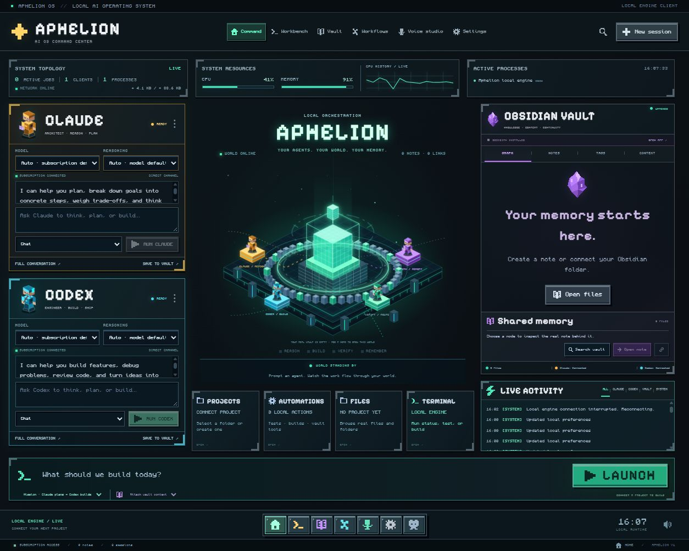

# Aphelion OS

A live, local AI command center with Minecraft-style buttons, pixel typography, an animated voxel core, and your real Obsidian vault on the front screen. Claude plans, Codex builds, and the local engine verifies the result. No sidebar or API-key fields.



## Open it

On Windows, open `release/Aphelion-OS-0.2.0-portable.exe`. No installer is needed. The app detects your existing official Claude Code and Codex account sign-ins. Use **Settings → Check connections** to refresh them.

For development, install Node.js 24 or later:

```sh
npm ci
npm run dev
```

The live browser client runs with `npm run dev:web` at http://127.0.0.1:5173. It uses the same local engine as the desktop: real subscription calls, local projects, watched vault files, processes, and measured telemetry.

## Use your subscriptions

Aphelion invokes the official **Claude Code** and **Codex CLI** installed on your computer. Sign in with your eligible Claude subscription and ChatGPT account. Authentication stays with those clients. Aphelion does not ask for, store, or extract account tokens or API keys.

```sh
npm install -g @openai/codex @anthropic-ai/claude-code
codex login
claude auth login --claudeai
```

The app checks account authentication before every request, refuses API-key authentication, and removes API billing/gateway credentials and inherited host-agent capabilities from child processes. Your subscription's normal usage limits apply. Model `auto` follows the official client's default.

See [Codex authentication](https://learn.chatgpt.com/docs/auth), [Codex non-interactive mode](https://learn.chatgpt.com/docs/non-interactive-mode), [Claude subscription support](https://support.claude.com/en/articles/11145838-use-claude-code-with-your-pro-or-max-plan), and [Claude Code programmatic mode](https://code.claude.com/docs/en/headless).

## Prompt agents from Home

Each Claude and Codex panel has its own prompt, **Model** dropdown, **Reasoning** dropdown, run/stop controls, streamed reply, and **Save to vault** action. Select Chat for conversation, Plan to inspect a project, or Build to edit a connected project. The two-agent mission prompt has a separate draft.

Model and reasoning choices come from the installed official clients. Switching to a model that does not support the current effort resets effort to Auto. Choices persist on this device and are captured for each run. The catalog describes client-supported choices; the provider checks your subscription's model access when you run a prompt.

The voxel workers walk and work while their real agent runs. Real vault note links appear as floating memory blocks in the center; click a block to attach its note to the next prompt or mission. Only attached notes are sent. Saving a response creates an actual Markdown file, which the watcher indexes into both graph views. The lights, data packets, and phase rail follow runtime events, with reduced-motion support.

See [Codex model discovery](https://learn.chatgpt.com/docs/app-server#list-models-modellist) and [Claude model and effort configuration](https://code.claude.com/docs/en/model-config).

## Launch a mission

1. Open **Projects** and select a real project folder or create one.
2. Optionally select vault notes under **Context**. Only selected context is sent to the agents.
3. Describe the task and click **Launch**. Claude inspects and plans; Codex implements within the selected project.
4. Follow real process events and streamed replies. Available package test/build scripts run after implementation. A successful mission saves a Markdown receipt in your connected vault.

Failed checks, interrupted work, or an agent that does nothing do not produce a completed mission. Partial replies and file changes remain available for review. **Stop mission** stops the owned agent or verification process.

The launcher also offers **Chat**, **Plan**, and **Build** separately. Chat disables filesystem tools; planning is read-only; building uses the selected project and the official client's workspace permissions. Environment or managed account restrictions can block an operation and are reported in the live output.

## Everything on the front screen

- **Claude/Codex:** direct home prompts, model and reasoning selectors, independent conversation history, streamed Markdown, stop, and save-to-vault actions.
- **Obsidian:** graph, notes, tags, context selection, safe Markdown editor/preview, search, create, refresh, and open the real app or note.
- **Projects/Files:** real folder connections, Git status/diff, and confined source browsing.
- **Terminal/Automations:** explicit status, files, diff, test, build, and check recipes with live process output. These are project actions, not background schedules.
- **System:** measured CPU/memory, actual engine traffic, current process IDs and jobs, live activity, and heartbeat-driven core lights and packets.
- **Voice:** system speech, available browser speech recognition, and an ElevenLabs website launcher for your existing account.

Animations respect reduced motion. Pixel button sounds are optional. The voxel scene and graph are interactive code, not a static reference image.

## Obsidian and local memory

The app detects the installed Obsidian app and registered vaults, connects an active vault, watches Markdown changes, and opens Obsidian through its official URI. **Connect vault** lets you choose another folder. Existing content and Obsidian plugin/security settings are preserved.

Aphelion's preferences and default vault live under `%APPDATA%/aphelion-os/`. Its default vault contains a few editable starter notes; existing vaults are never seeded. Notes use plain `.md` files. Reads/writes reject traversal, hidden paths, symlinks, oversized files, and stale revisions. Failed saves retain drafts; external edits refresh clean editor content.

Conversations stay in the client's local storage. Browser and desktop histories are separate. Provider credentials stay with the official clients. The browser engine binds to loopback and requires same-origin requests plus an ephemeral HttpOnly session cookie. The desktop renderer uses sandboxed, allowlisted IPC with no Node access.

## Shortcuts

| Shortcut | Action |
| --- | --- |
| Ctrl/Cmd + K | Command palette |
| Alt + 1…6 | Workspace tools |
| Ctrl + Shift + C / X | Claude / Codex |
| Enter / Shift + Enter | Send / new line |
| Ctrl/Cmd + S | Save current note |
| Escape | Close a dialog |

## Verify and package

```sh
npm test
npm run build
npx playwright install chromium
npm run test:e2e
node scripts/test-desktop.mjs
npm run package
```

Packaging uses a fresh local temporary folder outside OneDrive to avoid extraction locks, then copies the portable executable into `release/`. `release/package-info.json` records the unpacked executable for testing:

```powershell
$packageInfo = Get-Content release/package-info.json | ConvertFrom-Json
node scripts/test-desktop.mjs $packageInfo.unpackedExecutable
```

Tests cover subscription-only authentication, process isolation, real project commands, mission orchestration and cancellation, vault confinement and disk watching, transport origin/session checks, browser interactions, persistence, and responsive layout. Desktop smoke uses an isolated profile and proves local fonts, the sandboxed bridge, real telemetry, external note refresh, and a real npm test process. Browser tests replace the external bridge boundary to avoid account usage or personal-vault writes.

GitHub Actions run tests/builds and produce a Windows portable artifact. The Windows build is unsigned.

## Credits

[Monocraft](https://github.com/IdreesInc/Monocraft), by Idrees Hassan, and Pixelify Sans are included under their SIL Open Font Licenses. Icons, voxel scenes and button sounds are original. Aphelion OS is not affiliated with Minecraft or its creators.
